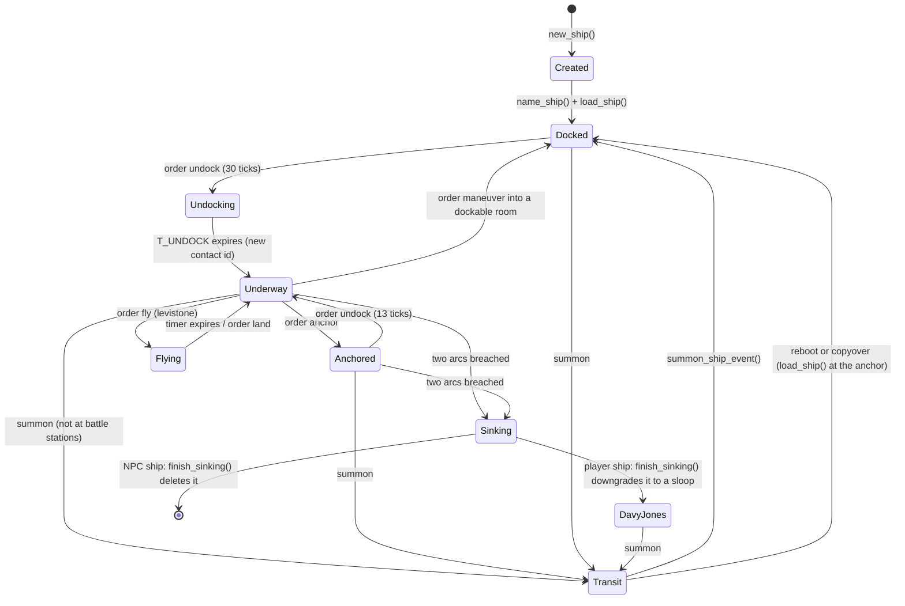

# Ship system

This is the engineering reference for the naval subsystem: player-owned
vessels, NPC pirates and hunters, sea combat, the cargo market, and how ships
are persisted. For commands, the hull/weapon/crew catalogues, prices and the
trade economy, see [SHIP_GAMEPLAY.md](SHIP_GAMEPLAY.md). Both documents were
written from the source at commit `2209da668` (2026-09-27). Where the code and
older text disagree, the code wins and the discrepancy is listed under
[Known issues and discrepancies](#known-issues-and-discrepancies).

The source files carry detailed `OVERVIEW` comments. This document collects them
into a single picture and adds the numbers and cross-module paths that the
comments leave out. Start with `src/ships/ships.h`, then `ship_utils.c`, then
`ship_base.c`.

Ferries (`src/world/ferryact.c`) are a separate, scripted transport system. They
share the word "ship" and the `ITEM_SHIP` object type, but none of the code
described here.

## Contents

- [Source map](#source-map)
- [Core concepts](#core-concepts)
- [Lifecycle](#lifecycle)
- [The heartbeat](#the-heartbeat)
- [Movement model](#movement-model)
- [Crew model](#crew-model)
- [Combat](#combat)
- [Flying ships](#flying-ships)
- [Ocean PvP state](#ocean-pvp-state)
- [NPC ships](#npc-ships)
- [Player autopilot](#player-autopilot)
- [Persistence](#persistence)
- [GMCP](#gmcp)
- [Integration with the rest of the game](#integration-with-the-rest-of-the-game)
- [Extending the system](#extending-the-system)
- [Tests](#tests)
- [Known issues and discrepancies](#known-issues-and-discrepancies)

## Source map

| File | Responsibility |
|------|----------------|
| `src/ships/ships.h` | Public data model: `ShipData`, `ShipSlot`, `ShipCrew`, the static-table structs, flags, constants, `SHIP_*()` accessor macros, the `ShipObjHash` registry, and every cross-module prototype. |
| `src/ships/ship_variables.c` | Static data only: ports, crews, chiefs, weapons, equipment, hull classes, per-arc properties, mount permissions, tactical-map symbols. |
| `src/ships/ship_utils.c` | Registry (`shipObjHash`), tactical map and contact list, geometry, speed/turn maths, crew mechanics, slot helpers, messaging, jettison/salvage, `ocean_pvp_state()`. |
| `src/ships/ship_base.c` | Lifecycle (create, name, lay out rooms, load, delete), the per-tick `ship_activity()`, docking, crashing, sinking completion, flying, summoning arrival, the save queue and both persistence backends' glue, the frag leaderboard. |
| `src/ships/ship_control.c` | Bridge commands. `ship_panel_proc()` dispatches `order`, `fire`, `lock`, `scan`, `look` and `get money`. Mostly input validation that calls into other modules. |
| `src/ships/ship_combat.c` | Hit chance (`weaponsight()`), firing, delayed volleys, sail/hull/weapon damage, `update_ship_status()`, sinking and reward settlement, ramming, the lookout report. |
| `src/ships/ship_cargo.c` | Cargo and contraband prices, the three market matrices, market drift, market persistence (SQL, flat file, maintenance snapshot), the immortal `world cargo` command. |
| `src/ships/ship_shop.c` | The shipwright (`ship_shop_proc()`) and crew hall (`crew_shop_proc()`), hull purchase through the epic-transaction service, repairs, reloads, customs (`check_contraband()`), and the automatons quest. |
| `src/ships/ship_auto.c`, `ship_auto.h` | Player autopilot (`order sail`). Also holds dormant fleet/"ship group" code. |
| `src/ships/ship_npc.c`, `ship_npc.h` | NPC content: pirate names, 45 fit-out rows, spawn logic, crew rosters, treasure, Cyric's Revenge, the disabled zone ship. |
| `src/ships/ship_npc_ai.c`, `ship_npc_ai.h` | The `NPCShipAI` state machine: target selection, basic and advanced combat manoeuvring, ramming, boarding, looting, escorting, despawn. |
| `src/ships/ship_identity.c` | Process-local `ShipRuntimeRef` (slot, generation) handles, so delayed events survive ship deletion. |

Integration points outside `src/ships/`:

| Location | What it does with ships |
|----------|-------------------------|
| `src/world/db.c` | Calls `initialize_ships()` during world boot. |
| `src/net/comm.c` | Runs `ship_activity()` once per second, and the GMCP flush plus `flush_pending_ship_saves()` every 2 pulses. It also calls `shutdown_ships()` on orderly shutdown and applies cargo maintenance completions. |
| `src/persistence/copyover.c` | Drains pending ship saves before copyover and aborts the copyover if any save cannot be made durable. |
| `src/persistence/maintenance_*.c` | Drives the periodic cargo-market update (job `cargo_market`). |
| `src/sql/sql_player.c` | SQL backend: `sql_save_ship()`, `sql_load_ship()`, `sql_load_all_ships()`, `sql_delete_ship()`. |
| `src/flatfile/flatfile_ship_repository.c` | Flat-file backend: the `ship_catalog` record and the legacy `Ships/` importer. |
| `src/redis/redis_ship_legacy.c` | Asynchronous invalidation of retired `ship:snapshot:*` Redis keys. |
| `src/net/gmcp.c`, `src/core/json_utils.c` | `Ship.Contacts` and `Ship.Info` packages. |
| `src/specs/specs.assign.c` | Attaches `ship_shop_proc`, `crew_shop_proc`, `erzul_proc` and `moonstone_fragment` to their rooms, mobs and objects. |
| `src/core/files.c`, `src/account/account.c` | Delete a character's ship with the character or account. |
| `src/net/modify.c` | Character renames move ship ownership. Immortal `rename ship`. |
| `src/cmd/actwiz.c`, `src/cmd/actinf.c` | Immortal `set ship ...` and `world cargo ...`. |
| `src/specs/specs.gellz.c` | Immortal test object 1203: `say ship all|owner|delete`. |
| `src/combat/fraglist.c`, `src/classes/drannak.c`, `src/world/hardcore.c` | Ship frag leaderboard and hardcore scoring. |
| `src/world/achievements.c` | Trader achievement (quick build) and the Sailor's Tattoo free-hull reward. |

## Core concepts

### Three identities

A ship has three unrelated identifiers. Do not mix them up:

| Identity | Field | Scope | Meaning |
|----------|-------|-------|---------|
| Database id | `ShipData::db_id` | Durable | Row id in `ships` (SQL) or `ship_id` in the flat-file catalog. `-1` until first saved. NPC ships never get one. |
| Contact designation | `SHIP_ID()` / `ShipData::id` | Visible to players | Two letters shown in contacts and combat messages, used by `lock`, `scan` and `signal`. Player ships draw from `A`–`W` as the first letter, NPC ships from `X`–`Z`. A docked ship shows `**`, and a new designation is minted on every undock. |
| Runtime reference | `ShipData::runtime_ref` | One process | A `(slot, generation)` pair from `ship_identity.c`. Delayed work (weapon volleys) stores this instead of a `P_ship` and resolves it later, which fails safely if the ship has been deleted or the slot reused. The slot number is 1-based, so `0` means no identity. |

Ownership is by name: `ShipData::ownername` holds the owning character's name,
and there is at most one ship per owner (`ships.owner_name` is `UNIQUE`).
`get_ship_from_owner()` looks a ship up by owner. `get_ship_from_char()` finds
the ship whose interior a character is standing in.

### Indices, units and append-only tables

- Hull class (`m_class`), weapon, equipment, crew and chief are stored as
  **0-based** indices into the tables in `ship_variables.c`, and are persisted
  verbatim. `ShipTypeData::_classid` is a separate, **1-based** external id.
- **Never reorder or insert rows** in those tables. Append, bump the matching
  `MAX*` constant in `ships.h`, and extend every parallel table (see
  [Extending the system](#extending-the-system)).
- Sides are `SIDE_FORE`, `SIDE_PORT`, `SIDE_REAR`, `SIDE_STAR` (0–3).
  `SLOT_HOLD` (4) and `SLOT_EQUI` (5) are extra slot positions for cargo and
  equipment.
- Headings and bearings are compass degrees in `[0, 360)`: 0 is north, 90 east.
- Crew skills are floats with a base of roughly hundreds to thousands (for
  example 200 for a raw pirate crew, 3000 for automatons). Both backends store
  them as thousandths.
- Money is in copper, and 1000 copper is 1 platinum. Prices in the tables are
  copper.

### Time units

- One **ship tick** is one second. `run_activity_phase()` calls
  `ship_activity()` every `WAIT_SEC` (4) pulses. Every `ShipData::timer[]` and
  slot timer counts ship ticks.
- Shop messages report maintenance in "hours" as `timer / 75`. That is a
  **mud hour** of 75 real seconds (`SECS_PER_MUD_HOUR`), so "installing takes
  10 hours" means 12.5 real minutes.
- Delayed events use the `nevent` scheduler, which counts **pulses** (quarter
  seconds). Volley flight time and summon travel time are in pulses.

### Where a ship is

Three separate notions, and the source warns against confusing them:

- `ship->location` is the **real room index** of the ocean or harbour room the
  hull object sits in.
- `ship->room[]` holds the ship's **interior rooms** as vnums, plus the exits
  between them.
- `ship->anchor` is the **vnum** of the dock the ship last docked at. It is
  persisted, and the ship reappears there at boot.

Interior rooms come from a fixed pool in zone 600 (`areas/wld/ship.wld`, vnums
60000–64999). The first three are reserved:

| Vnum | Room | Use |
|------|------|-----|
| 60000 | Davy Jones Locker | Where a sunk player ship is docked as a sloop (`VROOM_DAVY_JONES`). |
| 60001 | Speeding Across The Ocean | The hull waits here while summoned (`VROOM_SHIP_TRANSIT`). |
| 60002 | Aboard a spectral galleon | The undead ferry room. |

The remaining 4,997 rooms are handed out by `find_free_ship_room()`. A room is
in use while its `funct` is `ship_room_proc`, and `clear_ship_layout()`
returns it to the pool. The pool must stay contiguous. At 2 to 15 rooms per
hull it holds between 333 and 2,498 ships, depending on the hull mix.
`set_ship_physical_layout()` claims all of a ship's rooms or none: when the pool
runs out part-way, it gives back what it had claimed.

Each hull class has a fixed interior graph built by `set_ship_layout()`. It is
first built as slot indices, then wired to real rooms by
`set_ship_physical_layout()`. Slot 0 is always the bridge, where the control
panel sits. Players board and leave through the entrance slot:

| Class | Rooms | Entrance slot | Named rooms (from `name_ship_rooms()`) |
|-------|------:|------:|----------------|
| Sloop | 2 | 1 | |
| Yacht | 3 | 2 | |
| Clipper | 4 | 3 | |
| Ketch | 4 | 2 | |
| Caravel | 7 | 5 | |
| Carrack | 8 | 7 | |
| Galleon | 10 | 8 | |
| Corvette | 5 | 2 | Launch decks 1, 3, 4 |
| Destroyer | 8 | 5 | Launch decks 1–3 |
| Frigate | 9 | 7 | Launch decks 1–3 |
| Cruiser | 12 | 9 (docking bay) | Launch decks 7, 10, 11 |
| Dreadnought | 15 | 14 (docking bay) | Hold 7, launch decks 3, 8–10 |
| Large Ship (NPC only) | 2 | 1 | |

`set_ship_layout()` and `name_ship_rooms()` index rooms the same way and must be
changed together.

### Objects

| Vnum | Object | Special procedure |
|-----:|--------|-------------------|
| 60001 | The hull (`ITEM_SHIP`). One copy per ship floats in `ship->location`. `value[6] == 1` marks it as a map ship for `getmap()`. Its keywords are `ship <class> <owner>`, so `enter <owner>` works. | `ship_obj_proc` (boarding) |
| 60000 | The control panel on the bridge. | `ship_panel_proc` (all bridge commands) |
| 60002 | A floating cargo crate, created by jettison or sinking and picked up by `order salvage`. `value[0]` is the commodity and `value[1]` is 1 for cargo or 2 for contraband. | none |
| 1223 | Cargo information wand (immortal, must be held): `look cargo`, `look ships`. | `ship_cargo_info_stick` |

`ShipObjHash shipObjHash` is the authoritative registry of every ship, player
and NPC. It is keyed by the hull object and capped at `MAXSHIPS` (2000).

### Flags

`ShipData::flags` is persisted wholesale, so runtime bits such as `LOADED`,
`DOCKED` and `SUMMONED` travel through the database too. `load_ship()` clears
the transient ones (`SINKING`, `FLYING`, `RAMMING`, `SUNKBYNPC`,
`ATTACKBYNPC` and `SUMMONED`) and sets `DOCKED` and `LOADED`. The summon's
arrival event is not saved, so a summons in flight at a reboot or copyover is
dropped and the ship comes back at its anchor.

| Flag | Meaning |
|------|---------|
| `LOADED` | Placed in the world. Most code skips ships without it. |
| `AIR` | Permanently airborne-capable hull (Cyric's Revenge). Flies without a levistone timer. |
| `SINKING` | Sink timer running. |
| `DOCKED` | Alongside in port. Safe: cannot be locked onto, fired at or rammed. |
| `RAMMING` | `order ram` armed. |
| `ANCHOR` | Anchored at sea. Faster repairs and stamina regeneration. |
| `TO_DELETE` | Deleted by `initialize_ships()` at boot. Nothing in the live code sets it. |
| `SUMMONED` | A summons is in flight. |
| `SUNKBYNPC` | Set by `sink_ship()` when an NPC made the kill. It raises insurance to 90% and softens the sinking penalty. |
| `ATTACKBYNPC` | A merchant already ambushed since it last docked, so it is not ambushed again. |
| `FLYING` | Currently in the air. |
| `IMMOBILE`, `SQUID_SHIP` | Unused. Immobility is derived (`maxspeed == 0`, see `SHIP_IMMOBILE()`). |

`race` records which side the ship sails for. `order undock` stamps it from the
captain's racewar side: `GOODIESHIP`, `EVILSHIP`, `UNDEADSHIP`, `SQUIDSHIP`
(neutral) or `UNKNOWNSHIP`. NPC ships are `NPCSHIP`. Race decides hostility,
reward eligibility, `signal` and the flag other ships see when they scan.

## Lifecycle



- **Create.** `new_ship(m_class)` allocates the ship, loads a hull object and a
  panel, applies class defaults (full armour and sail, repair stock equal to
  hull weight, amateur crew, no chiefs, `**` designation, centred at map
  position 50,50), builds the abstract room graph and registers the runtime
  identity. It returns `NULL` with a code in `shiperror` at `MAXSHIPS` or when
  a prototype is missing.
- **Name.** `name_ship()` rebuilds the hull object's strings. The hull
  prototype's strings are shared by every copy, so the old pointers are
  dropped rather than freed. That is deliberate, not a leak.
- **Load.** `load_ship(ship, real_room)` first clears `LOADED`, which is saved
  with the other flags. It then claims interior rooms, puts the panel on the
  bridge and the hull in the room, sets `DOCKED | LOADED`, clears `SINKING`,
  `FLYING`, `SUNKBYNPC`, `ATTACKBYNPC`, `RAMMING` and `SUMMONED`, and records
  the room as the anchor. If it fails, usually because the room pool is full,
  every caller erases and destroys the ship. Boot keeps the stored ship and
  notes its owner (`note_unplaced_ship()`), and `retry_unplaced_ships()` places
  it about once a minute once rooms free up. A purchase is refunded or not
  charged.
- **Hull change.** A hull purchase first checks `ship_rooms_fit_class()`: the
  rooms the ship holds, which `reset_ship()` gives back, plus the free rooms in
  the pool must cover the new layout. If they do not, the purchase is refused
  before the epic transaction starts, or refunded if the pool filled up while
  it was pending. A first-ship purchase by someone whose stored ship is out of
  the world brings that ship back instead (`place_stored_ship()`), or is
  refused while there is no room, because a second ship could never be saved
  beside it.
- **Undock.** `order undock` checks the sails, mobility and
  `check_undocking_conditions()`: a legal name, weapons allowed on the hull,
  per-arc mount and weight limits, and the captain's level at least the hull's
  minimum. It sets `race` and starts `T_UNDOCK` (30 ticks, or 2 for an
  immortal). `ship_activity()` narrates the countdown and, at tick 1, assigns a
  fresh contact id and clears `DOCKED` and `ANCHOR`. Weighing anchor at sea
  uses the same countdown but finishes when it reaches 17, 13 ticks in, and
  skips the undocking checks.
- **Dock.** `dock_ship()` records the new anchor (queues a save), refills the
  repair stock to hull weight, resets the designation to `**`, drops all target
  locks on and by the ship, clears `ATTACKBYNPC` and restores crew stamina.
- **Sink.** `update_ship_status()` calls `sink_ship()` when two arcs are
  breached. `finish_sinking()` runs when `T_SINKING` expires (see
  [Sinking and insurance](#sinking-and-insurance)).
- **Delete.** `delete_ship()` requires the caller to have erased the ship from
  `shipObjHash`. For a player ship it deletes the durable row first and
  **aborts** (re-adding the ship to the hash) if that fails. It then releases
  the runtime identity and rooms, clears other ships' locks, frees the
  autopilot and AI, and extracts both objects. The `name`, `ownername`, `id`
  and `keywords` strings are knowingly leaked (see the note in `name_ship()`).

## The heartbeat

`ship_activity()` runs once per second over every loaded ship, in hash order.
For each ship:

1. Announce and decrement all `MAXTIMERS` timers.
2. Regenerate crew stamina (+3 a tick, +4 for NPC ships, +15 for Cyric's
   Revenge, ×4 while docked or anchored) and warn when it is negative.
3. Hold battle stations: `T_BSTATION` is reset to 180 ticks while a target is
   locked. The crew stands down 3 minutes after the lock is cleared.
4. Run crew repairs from the repair stock (see [Crew model](#crew-model)).
5. If sinking and `T_SINKING` has reached 0, call `finish_sinking()` and
   **return from the whole sweep**. For an NPC ship `finish_sinking()` frees the
   ship and erases it from the hash, so continuing would use a stale iterator.
   Ships later in the hash lose one tick when this happens.
6. Step the undock countdown.
7. If undocked, not anchored and not sinking:
   - converge `speed` on `setspeed` and `heading` on `setheading`, charging
     stamina (skipped while mindblasted);
   - move, crossing into the next map room when the fractional position leaves
     `[50, 51)`, or stop and possibly crash at a coastline;
   - resolve `RAMMING` when the target is within 1 room;
   - tick weapon reloads and equipment timers (paused while ramming, recovering
     from a ram, or mindblasted; each reload tick happens with probability equal
     to the stamina modifier);
   - run the player autopilot and the NPC AI;
   - roll for a pirate ambush.

Other ship work in the game loop:

| Cadence | Work |
|---------|------|
| Every 2 pulses (`run_recurring_persistence_phase`) | `gmcp_flush_dirty_ship_contacts()`, `gmcp_flush_dirty_ship_info()`, `flush_pending_ship_saves()` |
| Maintenance job `cargo_market` (checked every 240 pulses) | Market drift when `ship.cargo.update.secs` has elapsed, and a refresh of the delayed prices when `ship.cargo.updateDelayedPrices.secs` has elapsed. |
| Delayed `nevent` | `volley_hit_event()` (weapon impacts), `summon_ship_event()` (summon arrival) |

`cargo_activity()` and `timers_activity()` still exist but nothing calls them.
The maintenance scheduler replaced that path, and
`tests/async/test_maintenance_scheduler.py` pins that `comm.c` no longer calls
`timers_activity()`.

## Movement model

**Position.** A ship at sea always sits in one map room. `ship->x` and `ship->y`
are its fractional position inside that room, normally in `[50, 51)` on the
100×100 tactical patch centred on the ship. Each tick adds
`speed × sin(heading) / 150` to `x` and `speed × cos(heading) / 150` to `y`. A
ship at speed 100 therefore crosses a room every 1.5 seconds, and one at speed
40 every 3.75 seconds.

**Legal water.** `is_valid_sailing_location()` accepts only rooms with vnum
≥ 110000 that are map rooms with sector `SECT_OCEAN`. A flying ship accepts any
map room except mountains. When the next room is illegal the ship stops dead,
re-centres at 50.5, stops its autopilot, and then may crash:

- no chance unless the crew is at battle stations;
- otherwise the chance is `(speed + 50) / ((1 + 2 × sail_mod) × stamina_mod)`
  against `2d50`, with the speed the ship hit the coast at;
- certain while mindblasted.

`crash_land()` deals `hull_weight / 25 + 1` potential hits of 1–9 damage. The
first always lands on the fore arc; each of the rest has a 50% chance and picks
a random arc or the sails.

**Harbours.** `order maneuver <n|e|s|w>` moves one room at a time where sailing
is not allowed. A move is permitted only when the current or destination room
is off the open ocean map (vnum < 110000 or not `SECT_OCEAN`) or the destination
is `ROOM_DOCKABLE`. The ship must be undocked, landed, mobile and at speed ≤ 20.
Each move sets speed to 0 and starts a 5-tick cooldown (none for immortals).
Entering a dockable room or a zone room (vnum < 110000) requires the crew to
have stood down from battle stations. Arriving in a dockable room docks the ship
and runs customs.

**Speed and turning.** Orders only set `setspeed` and `setheading`, and the
heartbeat closes the gap:

- acceleration per tick = `truncate(class accel × (1 + sail_mod) × stamina_mod)`,
  and deceleration uses the same figure;
- turn per tick = `class turn rate × (0.75 + 0.25 × (speed − 9) / (class max − 9)) × (1 + sail_mod) × stamina_mod`.
  Slow ships turn worse and fast ships turn better. An immobile ship turns
  1° per tick. The turn always takes the short way round.
- stamina cost per tick: speed change
  `(|Δspeed| / accel) / (1 + sail_mod) × (2 + √hull / 10)`, heading change
  `(|Δheading| / turn rate) / (1 + sail_mod) × (3 + √hull / 10)`, the latter ×5
  if immobile.

**Maximum speed.** `update_maxspeed()` recomputes `ship->maxspeed` whenever
`update_ship_status()` runs:

```text
if (a surface ship has a breached arc) or mainsail == 0:  maxspeed = 0
ceiling  = class max speed + crew speed bonus (0-2), x1.2 if flying with no breach
speed    = ceiling (x1.2 again if flying with no breach, x0.5 if flying with one breach)
         x (1 + sail_mod)
         x (1 - (slot weight - free equipment weight - free cargo weight) / max weight)
         x mainsail / class max sail
maxspeed = clamp(speed, 1, ceiling)
```

Free equipment and free cargo weight are per-class allowances
(`_freeequip`, `_freecargo`) that do not slow the ship. The effective maximum
also adds `maxspeed_bonus` (always 0 today), plus 2 for a helmsman with the
`SEADOG` innate (humans, orcs and swashbucklers). Flying applies its 1.2 to
both the ceiling and the running total. That is an owner decision recorded in
issue #80.

**Capacity.** A ship will not take orders while it carries more than
`_mxpeople` people. `num_people_in_ship()` does not count immortals, NPC-ship
crew mobs (vnums 40201–40299) or images (vnum 250).

## Crew model

A ship has one crew (`ShipCrew`) with three skills and up to three chiefs:

- `sail_skill` (deck), `guns_skill` and `rpar_skill` (repair) are floats. They
  never fall below the hired crew type's base values.
- `sail_chief`, `guns_chief` and `rpar_chief` index `ship_chief_data[]`.
  `NO_CHIEF` is 0.
- `stamina` against `max_stamina`, which is the crew type's base stamina.

`ShipCrew::update()` derives the multipliers the rest of the code reads:

```text
rpar_mod_applied = sqrt(rpar_skill) / 150 + 0.03 x (crew level + crew rpar mod + chief rpar mod)
sail_mod_applied = 0.8 x (sqrt(sail_skill) / 150 + 0.03 x (...sail...)) + 0.2 x rpar_mod_applied
guns_mod_applied = 0.8 x (sqrt(guns_skill) / 150 + 0.03 x (...guns...)) + 0.2 x rpar_mod_applied
```

**Stamina.** Stamina is spent by steering, reloading, firing and repairing, and
may go negative. While it is positive the stamina modifier is 1.0. Below zero
it is `1 / (1 + |stamina| / max_stamina / 3)`, and it scales acceleration,
turning, the chance of each reload tick, hit chance, repair chance and reload
time. Displays show a deficit as `-sqrt(|stamina|)`.

**Training.** `skill_raise()` scales each gain by the chief's
`skill_gain_bonus` percentage. Below the chief's `min_skill` the crew learns
four times as fast.

| Source | Skill gain |
|--------|------------|
| Crossing a map room (not in a sloop or yacht) | sail +0.003 |
| Each reload tick against a valid target | guns +0.003 |
| Each shot at a valid target | guns +0.1 |
| Each successful repair | repair +0.1 at battle stations with a valid target, otherwise +0.01 |
| A ram attempt against a valid target | sail +1–3 |
| Selling cargo | sail +1.5 and repair +0.5 per 1,000 platinum of proceeds |
| Selling contraband | sail +1.0 and repair +0.33 per 1,000 platinum of proceeds |
| A kill | all three + the frag award (NPC kill: one tenth of the hull weight) |

"Valid target" (`HAS_VALID_TARGET`) means a locked target of a different race
that is not sinking.

**Casualties.** When a ship is sunk, `replace_members(p)` pulls each skill `p`%
of the way back to the crew type's base: `10 + frags_lost / 30` percent in PvP,
`5 + hull_weight / 100` percent when sunk by an NPC.

**Changing crews.** Hiring a new crew (`change_crew()`) keeps trained skills,
first losing 1–5% of each and then flooring at the new type's base. Stamina is
reset.

**Repairs at sea.** Each tick, while the repair stock is above 0 and the crew
is not mindblasted, the crew may repair. The chances below are per mille, then
multiplied by `(1 + rpar_mod_applied) × stamina_mod`:

| What | Only below | Anchored | Underway | Per success |
|------|-----------|----------|----------|-------------|
| Sails | `max × (rpar_mod + 0.4)` and 90% | 500 (with some sail), 100 (no sail, no battle stations), 30 (no sail, battle stations) | 30 (with some sail), 0 | +1–3 sail (crew bonus), −1 stock, −3 stamina |
| Damaged weapon | not destroyed | 200 | 200 | −1–3 damage level, ⅕ chance −1 stock, −1 stamina |
| Internal structure, per arc | `max × (rpar_mod + 0.1)` and 90% | 250 or 100 if the arc is at 0 (no battle stations); 100 or 10 (battle stations) | 30, 0 if the arc is at 0 | +1–3 (crew bonus), −1 stock, −2 stamina |
| Armour, per arc | only if no internal repair is needed, no battle stations, and `rpar_mod > 0.5`; below `max × (rpar_mod − 0.5)` and 90% | 150 | 20 | +1–3, −1 stock, −4 stamina |

The repair stock is refilled to the hull weight on docking. Ships never fully
repair at sea: the thresholds cap repairs well short of full, which is why
shipwright repairs exist.

## Combat

### Targeting

`lock <id>` (captain, a group-mate of the online captain, or an immortal)
selects a contact and puts the crew at battle stations. Docked ships cannot be
locked. Weapons fire only at the locked target. `lock off` clears it. Docking
or deleting a ship drops every other ship's lock on it
(`clear_references_to_ship()`).

Firing requires: not sinking, not docked or anchored, on a map room, a locked
target, not mindblasted (`T_MINDBLAST`) and no ram recovery (`T_RAM_WEAPONS`).
`fire <slot>` fires one weapon and `fire fore|port|starboard|rear` fires every
weapon on that arc. Each weapon must also have the target inside its range
band, have it bearing in its own arc, be undamaged, be reloaded and have ammo.

**Arc geometry** (`get_arc()`): relative to the ship's heading, fore is ±40°
(80° wide), starboard 40°–140°, rear 140°–220° and port 220°–320°. The beams
(100° each) are the bigger targets, which is why they carry more armour.

### Hit chance

`weaponsight()` projects both ships one tick ahead (pending turn and speed
change included) and measures how fast the firing solution is moving:

- **crossing speed**: the target's velocity across the line of fire;
- **angle speed**: how fast the relative bearing is swinging;
- **closing speed**: how fast the range is changing.

Ballistic weapons (catapults) weight closing speed heavily. Direct-fire weapons
(ballistas, beams) weight crossing and angle speed. The model then:

1. starts from 0.5 at maximum range and divides by `1 + speed / 50`;
2. adds `√hull − 3` percentage points for the target's size;
3. shrinks the miss chance as range closes from maximum to a quarter of
   maximum, with no further gain inside that;
4. divides the miss chance by `1 + guns_mod_applied`, and multiplies it by 1.5
   against a flying target;
5. multiplies the hit chance by the stamina modifier and clamps it to 1–100%.

`volley_hit_event()` hits when `2d50 ≥ 100 − N`, which is not a flat N%: two
dice push the result towards the extremes. Players are shown the real chance,
`volley_hit_percent(N)` (rounded), both in `look sight` and when firing:

| N (`weaponsight()`) | 10 | 20 | 30 | 40 | 50 | 60 | 70 | 80 | 90 |
|-------|----:|----:|----:|----:|----:|----:|----:|----:|----:|
| Real chance | 2.6% | 9.2% | 19.8% | 34.4% | 53.0% | 70.4% | 83.8% | 93.2% | 98.6% |

Ramming rolls a flat percentage, so its shown chance is already exact.

### Firing and volleys

`fire_weapon()` announces the shot and spends one round. It starts the reload
at `reload_time × (1 − 0.15 × guns_mod_applied) / stamina_mod` ticks and spends
stamina (`weight / (√hull / 10)`). It marks everyone aboard both ships with the
60-second `TAG_PVPDELAY`, puts the shooter at battle stations, and schedules
`volley_hit_event()` after `(range / max_range) × volley_time` pulses, ±10% and
at least 1.

The **hit chance is frozen at firing time** and carried on the volley, so a
defender cannot dodge a shot already in the air. The volley stores both ships
as `ShipRuntimeRef` values. If either ship is gone when it lands, or the target
has docked or slipped into a zone room (vnum < 110000), it is dropped. If the
target is out of sight when it lands, it resolves as if fired from bearing 0 at
range 35.

On landing the target is forced to battle stations and its NPC AI (and any NPC
escorts) is told who attacked. A hit is resolved fragment by fragment:

- With probability `sail_hit`% (if the target has sail left) the fragment hits
  the sails for `damage × sail_dam%`.
- Otherwise it hits the hull, on the target arc facing a direction scattered
  `±hit_arc / 2` around the attacker's bearing, for `damage × hull_dam%`, with
  the weapon's `armor_pierce`.
- Damage is rolled from `min–max`, except `RANGEDAM` beams, which scale linearly
  from max damage at minimum range to min damage at maximum range.
- `MINDBLAST` sets `T_MINDBLAST` to `5 + 15 × range_mod` ticks (a third of that
  against Cyric's Revenge). Inside mid-range it also knocks everyone aboard
  sitting for two combat rounds. A mindblasted crew ignores orders, stops
  steering, reloading and repairing, and will certainly crash into a coast.

### Damage model

Each arc has **armour** over **internal structure** (`damage_hull()`):

1. Armour absorbs first. If the hit does not break through, there is an
   `armor_pierce`% chance of a **critical hit** that carries half the damage
   inside (with a 50% weapon-damage chance). Otherwise the hit stops at the
   armour.
2. Overkill damage spills into the internal structure (15% weapon-damage
   chance).
3. If that arc's internals are already gone, a third of hits deflect into
   another arc that still has structure. A hit on a hollowed-out arc always
   damages a weapon.
4. Weapon damage adds `damage × 5` to a random surviving weapon on that arc
   (`val2`). A weapon is damaged at 1 or more (cannot fire) and destroyed at 100.
5. One hull hit in nine knocks everyone aboard off their feet.

Before any of that, and before sail damage in `damage_sail()`, the owner's
**Ship Damage Control** epic skill reduces the hit while the owner is aboard
(`captain_is_aboard()`): `epic_ship_damage_control()` removes 4% plus a fifth
of the skill in percent (24% at 100), never going below 1 point. Damage a
character deals to a hull (`ch_damage_hull()`) is not reduced.

`update_ship_status()` clamps values at zero and counts **breached** arcs
(armour and internal both 0):

- two or more breaches on an undocked ship: `sink_ship()`;
- one breach: `maxspeed = 0` (immobile), except a flying ship, which keeps half
  speed;
- no sail: immobile.

Its `attacker` argument is what credits the kill, so callers pass it whenever
damage came from a ship.

### Ramming

`order ram` (needs a locked target, speed ≥ 20 and the `T_RAM` cooldown clear)
sets `RAMMING`. While it is set, weapon reloads pause. Each tick
`ship_activity()` calls `try_ram_ship()` once the target is within 1 room. The
mode stands down if the target is lost or speed falls to 9 or below.
`try_ram_ship()`:

- requires the target inside a 120° cone ahead and both ships at the same
  "altitude" (flying versus surface ships pass over or under each other);
- computes the closing speed from the heading difference. A target running away
  faster than the rammer escapes.
- success chance falls as the rammer's hull outweighs the target's and as both
  ships' speeds rise (`hull_mod` is divided by 10 against a stationary target),
  then is improved by deck skill;
- on success, each side takes `(hull + 100) / 10` base damage scaled by speed and
  closing speed, ×1.2 for fore-arc impacts, dealt in 2–6 point hits across arcs
  and occasionally the sails. A fitted **ram** adds a heavy fore hit of about its
  own weight, `(hull + 10) / 24`, and halves fore-arc crash damage taken. The
  heavier ship spins the lighter one to a random heading. Both crews are
  knocked down.
- cooldowns: `T_RAM` 50 ticks after a success or 25 after a failure, and
  `T_RAM_WEAPONS` 25 ticks after a success. Both are reduced by up to 15% by
  crew skill.

### Sinking and insurance

`sink_ship()` sets `SINKING`, stops the ship, lands it if flying, cancels its
autopilot and starts `T_SINKING`:

| Ship | Sink timer |
|------|-----------|
| Player ship | 75–150 ticks (1¼–2½ minutes) |
| NPC ship | 1000–1500 ticks, so the wreck can be boarded and looted |
| Cyric's Revenge | 7500 ticks |

Rewards are settled immediately:

- **Who gains.** The attacker. If the attacker is an NPC escorting a player ship,
  that player ship gains. Any other NPC attacker credits nobody.
- **Frags**: the target's hull weight, only across a race boundary. NPC victims
  pay no frags (Cyric's Revenge pays a fifth), only crew training of a tenth.
  A captain aboard for a 20+ frag kill earns `EPIC_SHIP_PVP` progress.
- **Salvage**: the hull's list price × the fraction of armour and internals
  remaining, plus surviving weapons at half list (a tenth if damaged), divided
  by `ship.sinking.rewardDivider`. It is paid across a race boundary or for any
  player victim. Sloops are worth nothing.
- **Bounty**: `target frags × 10000 / rewardDivider` copper when the target had
  more than 100 frags and a different race. NPC fit-outs carry frags, so they
  pay a bounty.
- **Split.** Frags are divided by the number of same-race, non-sloop, undocked
  ships in contact with the wreck (NPC escorts of that race count). Salvage and
  bounty are divided by the number of non-sloop, undocked ships in contact whose
  owners are grouped with the gainer's captain. The gainer and every such
  grouped ship are then paid a share. Money goes into the ship's **coffers**
  (`ShipData::money`), collected with `get money` at the panel.
- **Penalty.** The victim loses the per-ship frag share (floored at zero) and
  crew casualties as described above. Nothing is lost when sunk by an NPC.

`finish_sinking()` runs when the timer expires. An NPC ship with a player aboard
is postponed 30 ticks. Otherwise `clear_ship_content()` empties the interior:

- players are moved into the room the hull is in;
- **every NPC aboard is extracted**, pets and followers included;
- **loose objects are destroyed**, except player corpses, which are moved out.

The hold is then jettisoned (about half becomes floating crates), and:

- **Player ships are not destroyed.** Insurance is paid: nothing for a sloop,
  90% of hull list price if sunk by an NPC, 75% for a merchant hull, 50% for a
  warship. It goes to the owner's bank as a currency transaction when they are
  online, otherwise to an auction-house money pickup, and as a last resort into
  the ship's coffers. The hull is downgraded to a **sloop** with every slot
  emptied, the sails are set to 0 (unless sunk by an NPC from a larger hull),
  and the ship is docked in Davy Jones' Locker. Frags and crew survive.
- **NPC ships** are erased and deleted.

## Flying ships

A **Zentharium Levistone** (equipment 1, capital) lets any hull above a yacht
fly. `order fly` needs the stone recharged and a map room. The ship then flies
for 60 ticks and lands automatically, and the stone recharges for 600 ticks.
`order land` lands early. While flying:

- the ship can cross any map terrain except mountains;
- the speed bonuses above apply, and one breach halves speed instead of
  immobilising;
- it cannot be boarded or left (immortals excepted), cannot anchor or maneuver,
  and rams pass over or under it;
- shots at it miss 50% more often;
- the levistone weighs nothing.

Landing over land stops the ship on the land room, and it must `order maneuver`
back onto adjacent water. There is no damage, despite what the comment on
`land_ship()` says. `ShipData::z` is never set, so flying gives no range
advantage (see [Known issues](#known-issues-and-discrepancies)).
Hulls with `AIR` fly without the timer. Only Cyric's Revenge has it, and its AI
takes off at random.

## Ocean PvP state

`ocean_pvp_state()` is true when two undocked, non-NPC ships of different races
share an ocean map. It uses `getcontacts(ship, false)`, so there is **no range
limit**. Sloops, and yachts with no weapons, never count. The state:

- doubles sloop and yacht summon times and adds 15 mud hours for larger hulls;
- multiplies hull-change build time by 5 and equipment install time by 4;
- suppresses pirate and hunter ambushes.

It walks every ship and rebuilds the shared `contacts[]` buffer, so it is
expensive and clobbers any contact index a caller holds.

## NPC ships

### Spawning

Every tick, each undocked ship that is moving and has no target rolls
`1 in (ships.pirate.load.chance + 1)`. With a diplomat's flag it rolls against
`ships.pirate.diplomat.load.chance` instead (shipped values 1000 and 60000, code
defaults 7200 and 30000). `try_load_pirate_ship()` then refuses against NPC
ships, sloops, yachts and during ocean PvP. It rolls
`n = random(0, hull weight) + frags`:

- **Merchant hulls** are ambushed once per trip (`ATTACKBYNPC`, cleared on
  docking): `n < 250` level 0 pirate, `< 1200` level 1, `< 2200` (or 3 times in
  4) level 2 with a 1-in-3 chance of a hunter, otherwise a level 3 hunter.
- **Warships** must beat a `1..1000` roll to be noticed at all, then draw a
  level 2 hunter (a level 3 one in 3 times).

`try_load_npc_ship()` places the NPC 45 rooms off the target's bow (±45°),
preferring a hull at least as fast as the target minus 10, and points it back at
the target at full speed. `find_ship_setup()` picks a random `npcShipSetup[]`
row for the level. `load_npc_ship()` creates the ship, gives it a random name
from `pirateShipNames[]` (players cannot use those names), applies the fit-out,
loads the crew and treasure chest, assigns an `X`–`Z` designation and undocks
it. Against a diplomat, any mindblast cannon is swapped for a light beamcannon.
The brain is **advanced** always at level 3 and above, half the time at level 2
and one time in five at level 1.

| Level | Fit-outs | Frags (sets the bounty) | Crew roster |
|------:|----------|-------------------------|-------------|
| 0 | 5 clippers, 4 ketches, 2 caravels | 150–300 | Northshore Pirates tier (mobs 40220–40230) |
| 1 | 4 ketches, 3 caravels, 3 corvettes | 500–600 | Twilight Cove tier (40231–40241) |
| 2 | 5 corvettes, 7 destroyers | 700–1000 | Marauders tier (40242–40252) |
| 3 | 3 corvettes, 3 destroyers, 2 frigates | 2000–3000 | Dark Sun tier (40253–40263) |
| 4 | 3 dreadnoughts (+ one `SH_ZONE_SHIP` row, which "any hull" never picks) | 3000–4000 | Demon tier (40264–40274) |

Crew sizes are 8 (clipper), 9 (ketch), 12 (caravel, corvette), 15 (destroyer),
18 (frigate) and 25 (dreadnought). `load_npc_ship_crew()` fills berths in order
of importance: captain, first mate, specialists, then grunts. It puts a treasure
chest (objects 40215–40219) aboard and its key on the captain.

### The brain

`NPCShipAI::activity()` runs from the heartbeat. It does nothing off the map,
while sinking, while mindblasted, or when **no captain is on the bridge**
(killing the captain disables the ship). Modes:

| Mode | Behaviour |
|------|-----------|
| `NPC_AI_ENGAGING` | Out of ammo → running. Target gone → cruising. Immobile → fight from where it lies. Land in the way → fire over it and path around it (Dijkstra). Ram when worthwhile. Board when the target is slow enough (a merchant at speed ≤ 9, a warship stopped). Otherwise basic or advanced manoeuvring. |
| `NPC_AI_RUNNING` | Flee the target, or resume cruising once it is gone. |
| `NPC_AI_CRUISING` | Pirates and hunters look for a target, escorts shadow their charge, then fall through to leaving. |
| `NPC_AI_LEAVING` | Cruise, reload and repair slowly, and despawn when allowed. |
| `NPC_AI_LOOTING`, `NPC_AI_IDLING` | Placeholder or initial states. |

- **Targets** are undocked, non-sinking ships of the four player races.
  Diplomats are never selected, and NPC ships never fight each other. Being shot
  sets the attacker as the target unless the ship is already engaging or
  running. An escort shot by its own charge turns hunter.
- **Basic combat** ranks the four arcs, turns a useful arc onto the target and
  opens or closes range. **Advanced combat** predicts both ships several steps
  ahead, evaluates rotations and broadside destinations, and steers for the
  best side. Both issue the same orders and use the same firing code as players.
- **Boarding** loads grunts from the crew roster into the target's rooms: the
  bridge first, then half the rooms for high tiers or three quarters for low
  tiers. Each target is boarded at most once. A **pirate** then steals part of
  the hold (40–60% of what is taken is lost in transfer and another 40–60% left
  behind, limited by its own capacity) and leaves. A **hunter** keeps fighting.
- **Despawn.** Losing the target or charge starts a 300-tick countdown.
  `try_unload()` fires at the last tick unless a player is aboard. It adds 10
  ticks if any undocked player ship is still in contact, so NPC ships do not
  vanish in front of witnesses. NPC ships are never persisted.
- **Debugging.** An immortal can attach to a spawned ship (`debug_char`) to
  receive AI traces. On any ship's panel, immortals can use `lock ai_off`,
  `ai_pirate`, `ai_hunter`, `ai_escort`, `ai_advanced` and `ai_basic`, and
  `fire pirate|hunter|escort [level]` spawns an NPC near the ship.

### Cyric's Revenge and the zone ship

Cyric's Revenge is a unique level-4 dreadnought spawned once at boot on a
random ocean room (`load_cyrics_revenge()`, 20 attempts). It is not respawned
until the next boot. It is a permanent, advanced hunter with the `AIR` flag and
never initiates combat (`find_new_target()` returns false for it). Other
differences:

- it pays a fifth of the normal frags;
- its crew regenerates stamina at 15 a tick and it slowly regains ammo in
  combat;
- it resists mindblast (a third of the stun);
- it takes 7500 ticks to sink;
- it carries a hand-built demon crew, a locked hold (key 40225), and a chest
  holding the automatons moonstone core and the nexus key. The nexus stone
  itself is in room slot 7 (`get_cyrics_revenge_nexus_rvnum()`).

The zone ship ("The Black Pearl", a mobile zone entrance) is disabled
throughout. Its code is commented out in `ship_npc.c`, `ship_base.c` and
`ship_combat.c`, and `load_zone_ship()` is declared but not defined.

## Player autopilot

`order sail <0-359|n|e|s|w> <0-35>` (or `order sail off`) needs open sea and no
anchor. `engage_autopilot()` projects a target room `distance + 1` rooms along
the heading on the tactical patch. `autopilot_activity()` then, each tick:

- steers towards the target room;
- stops to turn when more than 30° off course;
- slows to 60, 30 and 10 inside 2.5, 1.5 and 0.5 rooms;
- stops and reports "Destination has been reached."

It does not avoid land. Running aground stops it, as do anchoring,
maneuvering, sinking and a lost target room. The dormant fleet ("ship group")
functions in `ship_auto.c` have no callers.

## Persistence

### What is saved

Player ships only (`queue_ship_save()` and `write_ship()` ignore NPC and
unloaded ships). Everything that `ship_save_signature()` hashes is saved: class,
name, owner, frags, anchor, time, sail, race, coffers, flags, per-arc
armour/internal, the crew index, three skills and three chiefs, and all 16
slots. Maximum armour and internals are not stored, since they come from the
class.

### Backends

The backend is selected at compile time by `__NO_MYSQL__`.

**SQL** (the production build). Six tables, created by the legacy baseline
(`migrations/bootstrap_multithread_safe.sql`). No immutable migration has
changed them since:

| Table | Key | Contents |
|-------|-----|----------|
| `ships` | `id`, `UNIQUE(owner_name)` | `ship_name`, `ship_class`, `frags`, `anchor_room`, `time_played`, `mainsail`, `race`, `money`, `flags`, timestamps |
| `ship_armor` | `(ship_id, side)`, FK cascade | `armor`, `internal` per side |
| `ship_crew` | `ship_id`, FK cascade | `crew_index`, skills ×1000, three chiefs |
| `ship_slots` | `(ship_id, slot_index)`, FK cascade | `slot_type`, `item_index`, `position`, `timer`, `val0`–`val4` |
| `ship_cargo_market_mods`, `ship_cargo_prices` | indexed `(type, port_id, cargo_type)` | Market modifiers and last published prices (`type` is `CARGO` or `CONTRABAND`). |

`sql_save_ship()` inserts the `ships` row on first save (then reads back the
id) or updates it. It then upserts armour, crew and slots in one multi-statement
batch inside a transaction, joining the caller's transaction if one is open
(`shutdown_ships()` owns one). When the batch fails, only a ship whose row this
same call inserted goes back to `db_id == -1`. An existing ship keeps its id, so
its retry updates rather than inserting into `UNIQUE(owner_name)`. A failed
COMMIT may still have been applied, with its reply lost. So a ship whose row it
inserted keeps the id, marked unconfirmed (`ShipData::db_id_unconfirmed`). Its
next save looks the row up by id first, then updates it, or inserts again if
the row is not there. `sql_load_all_ships()` loads every owner's ship at boot
through `sql_place_ship()`. A ship that `load_ship()` cannot place is destroyed
in memory, and its row is kept and retried (see **Load** above).
`sql_delete_ship()` deletes the `ships` row (children cascade) and queues
invalidation of the retired Redis snapshot key.

**Flat file** (`__NO_MYSQL__`). One checksummed catalog,
`<state root>/domains/ship_catalog` (magic `DURSHIP\0`, version 1, atomic
writes, owner pid cross-checked against the identity store). Every field that
becomes an array subscript is range-checked on load and on save
(`flat_ship_slot_is_loadable()` checks each slot's item index against the table
its own type selects). A missing catalog is first seeded from a legacy
`Ships/` directory (`ship_index` plus version-3 per-owner files), otherwise
created empty. Any load failure is **fatal at boot**, because the flat file is
the only authority, except a ship the full room pool cannot place, which stays
in the catalog and is retried like an SQL one. The cargo market lives in `<state root>/metadata/cargo_market`
(magic `DURCARGO`, SHA-256 trailer).

`lib/etc/ship_index` is an empty leftover of the pre-SQL flat-file layout and
is not read. `migrations/tools/migrate_ships.c` is the offline migrator from
those legacy files (not part of the default build).

### When ships are written

- **`queue_ship_save(ship, reason)`** is the normal path. It marks the ship
  pending, and `flush_pending_ship_saves()` (every 2 pulses) writes it unless
  its signature matches the last durable write. A failure keeps the ship pending
  with a 1-second retry gate. The docking, purchase, repair, hiring, cargo,
  combat-reward, sinking and summon paths all queue, and so does a player
  checkpoint, for the loaded player ship the character owns (not one they stand
  in).
- **`write_ship()`** writes immediately. Besides the queue's own flush and
  drain, it is called directly by `shutdown_ships()`, by `rename_ship()` and
  `rename_ship_owner()`, and by the fallback branch of the player save
  `do_save_silent()` (a character without a pid, or a terminal save type),
  which writes the character's own loaded ship and reports a failed write as a
  failed save. `rename_ship_owner()` restores the old owner and name if the
  write fails; `rename_ship()` does not roll back.
- **Character rename.** `rename_character()` stores the player row, the ship
  the character owns (`get_ship_from_owner()`, wherever they stand) and
  everything else their name keys in one transaction, `sql_rename_character()`.
  That covers the account mapping login reads, a personal locker and its access
  list, their locker grants, guild roster row and top-fragger credit, and their
  leaderboard name. Corpses keep the name they were made under. The ship's new
  owner is set in memory first (`begin_ship_owner_change()`). Unless the
  transaction commits, it is put back from memory, with no further write, and
  only a committed rename renames the live guild roster. A failed COMMIT is
  settled by reading the player row back. If that read fails too, the rename is
  reported as failed and staff are told it may have been stored, but every row
  still carries the same name. The rename waits while the character's personal
  locker is open, since that locker would otherwise save under the old name.
- **Copyover.** `drain_pending_ship_saves()` ignores the retry gate. If any
  pending ship cannot be made durable, the copyover is aborted.
- **Shutdown.** `shutdown_ships()` puts every passenger and loose object in a
  ship at the ship's anchor room, skipping rooms a ship does not have, then
  writes every ship in one SQL transaction. A failed write or commit of a
  loaded player ship is treated as corruption (`panic_corruption()`).
- **Boot.** `initialize_ships()` attaches the procedures, loads every ship that
  fits in the room pool at its anchor (docked), deletes ships flagged
  `TO_DELETE`, loads the cargo
  market, spawns Cyric's Revenge and seeds the moonstone fragments (skipped
  during Redis world recovery).

### Deletion paths

- Character deletion (`deleteCharacter()` in `src/core/files.c`) runs
  `sql_delete_ship()` inside the same transaction that deletes the player. Only
  after the commit does it drop the runtime ship with `delete_ship_runtime()`,
  which does no second durable delete.
- Account deletion (`remove_deleted_account_runtime()` in
  `src/account/account.c`) invalidates each character's legacy Redis snapshot
  and calls `delete_ship_runtime()` once the durable deletion has completed.
- Immortals can delete a ship with test object 1203 (`say ship delete <owner>`).
- `sell ship` is disabled, so players cannot delete their own ship.

See [CHARACTER_DELETION.md](../persistence/CHARACTER_DELETION.md) and
[ACCOUNT_ERASURE.md](../persistence/ACCOUNT_ERASURE.md) for the ordering
guarantees.

### Redis

Ship state is SQL-authoritative. The old Redis ship snapshot routes are retired:
`redis_invalidate_ship_snapshot()` only enqueues deletion of the legacy
`ship:snapshot:<owner>` key on a bounded background worker (`redis_ship_legacy.c`)
using the maintenance identity. `scripts/clear-redis.sh` also removes those
keys. See [CONFIGURATION.md](../operations/CONFIGURATION.md).

## GMCP

GMCP-enabled players **standing on the bridge** receive two packages, flushed
every 2 pulses and sent only when their content hash changes:

- **`Ship.Contacts`**: own `heading`, `speed` and world coordinates, then one
  entry per contact with `id`, `name`, `x`, `y`, `range`, `bearing`, `heading`,
  `speed`, `arc`, `race` (only inside scan range 20 and undocked), `status`,
  `targeting_you` and `you_targeting`. It is sent only on the open sea and
  undocked, and also when the ship changes room. Docked contacts beyond range 5
  are omitted, as in `look contacts`.
- **`Ship.Info`**: `name`, `id`, `captain`, `class`, `frags`, `status`,
  `maxSpeed` (with the recipient's `SEADOG` bonus), `contactRange`, `sail`,
  `maxSail`, `crewStamina`, `maxCrewStamina`, `repairStock`, `crewType`,
  `chiefs`, `skills`, `skillMods`, `people`, `maxPeople`, per-arc `armor` and
  `internal` as `[current, max]`, and `weapons` and `equipment` arrays with ammo,
  damage and readiness.

Passengers with GMCP also get `Room.Map` renders of the ocean around the ship
(`src/net/comm.c`, `src/world/handler.c`). Passengers with the `PLR2_SHIPMAP`
toggle get a text look-out every time the ship changes room.

## Integration with the rest of the game

- **Frag leaderboard.** `update_shipfrags()` keeps the top 20 ships by frags.
  `display_shipfrags()` prints the top 10 ("10 most dangerous ships") for the
  frag list. Hardcore scoring adds a character's ship frags.
- **Achievements.** Selling 10,000 cargo crates completes **Trader**
  (`AIP_CARGOCOUNT`), which halves build and install times. **The Sailor's
  Tattoo** (level 20, or granted at creation to Chaos characters) gives
  `AIP_FREESLOOP`. That is 100 platinum off a first hull (a free sloop) at any
  shipyard, or a free frigate when `CHAOS_STARTER_FRIGATE` is enabled
  ([CHAOS_MODE.md](CHAOS_MODE.md)). Players who already own a ship get 100
  platinum instead.
- **Innates.** `SEADOG` adds 2 to maximum speed at the helm and 10% to cargo
  sale proceeds.
- **Epic.** `EPIC_SHIP_PVP` progress for PvP kills. The **Ship Damage Control**
  epic skill reduces sail and hull damage to its owner's ship while the owner
  is aboard (see [Damage model](#damage-model)). It is taught only by the
  headless commodore (mob 2733) in 10-point lessons. `epic_teacher()` charges
  three times the table's 80 points and twice its 8,000 platinum, so the first
  lesson costs 240 epic points and 16,000 platinum, and the price rises with
  the skill (`epic.progressFactor`). New Chaos characters with starter epic
  skills enabled are granted it at 100 ([CHAOS_MODE.md](CHAOS_MODE.md)).
- **Economy hooks.** Cargo purchases apply `EPIC_BONUS_CARGO`. Cargo sale
  proceeds pass through `check_nexus_bonus(NEXUS_BONUS_CARGO)`.
- **CTF.** A ship carrying a CTF flag (objects 790–792, or a flag carrier aboard)
  has its ordered speed cut by `(speed / 12)²`.
- **Automatons quest.** Two moonstone fragments (object 12028: one on mob 23240
  or in room 31724, one on mob 12027) and the core (12029, in Cyric's Revenge's
  chest) fuse into the moonstone (12001) when carried together. Erzul (mob 9453)
  trades it for the Magical Automatons crew (3000 frags and 40,000 platinum) or
  a ring (object 9460).

## Extending the system

All table identifiers are persisted, so every change is **append-only**.

- **New hull class.** Append a row to `ship_type_data[]`, `ship_arc_properties[]`,
  `ship_allowed_weapons[]` and `ship_allowed_equipment[]`. Add a `SH_*` constant
  and bump `MAXSHIPCLASS`. Add a `case` to both `set_ship_layout()` and
  `name_ship_rooms()`. Check the room pool can hold the new layout, and the
  flat-file legacy importer's `legacy_ship_class_count`. `buy_hull()` treats the
  **last** class as NPC-only, so inserting before `SH_ZONE_SHIP` changes which
  hull is excluded. Update the hull tables in [SHIP_GAMEPLAY.md](SHIP_GAMEPLAY.md).
- **New weapon.** Append to `weapon_data[]` with a `WPNFLAG` set, add a `W_*`
  constant, bump `MAXWEAPON`, and add a column to **every** row of
  `ship_allowed_weapons[]`.
- **New equipment.** Append to `equipment_data[]`, bump `MAXEQUIPMENT`, add a
  column to `ship_allowed_equipment[]`, and give it behaviour.
  `ShipSlot::get_weight()` special-cases hull-relative weights.
- **New crew or chief.** Append to `ship_crew_data[]` or `ship_chief_data[]`
  with hire rooms, and bump `MAXCREWS` or `MAXCHIEFS` if the table is full
  (`ship_crew_data[]` has 24 rows and a 25th zero-filled slot). The hire room
  must also have `crew_shop_proc` attached in `specs.assign.c`, otherwise the
  crew only appears in the list-everything room 77.
- **New port.** `NUM_PORTS` sizes the port list, both market matrices, the
  commodity names, `cargo_location_data[]` and `cargo_location_mod[]`, and the
  persisted slot index range for cargo. Adding one changes the flat-file cargo
  record size and the maintenance snapshot layout, so treat it as a migration.
- **New NPC fit-out.** Write a `setup_npc_*()` function and add one
  `npcShipSetup[]` row. Nothing else is needed.

After any change: `make -C src`, then the ship tests below. Update both
documents.

## Tests

The focused regressions live in `tests/async/`. Run them directly, for example
`python3 tests/async/test_ship_save_guards.py`.

| Test | Covers |
|------|--------|
| `test_ship_save_guards.py`, `run_ship_save_guards.sh` | Every mutation path queues a save. Both backends carry every slot field. |
| `test_ship_save_queue_dedup.py`, `run_ship_save_queue_dedup.sh` | Signature-based save coalescing. |
| `test_ship_rename_save_guards.py`, `run_ship_rename_save_guards.sh` | Rename persistence ordering. |
| `test_ship_owner_rename_failure.py`, `run_ship_owner_rename_failure.sh` | `rename_ship_owner()` rollback. |
| `test_ship_nested_transaction.py`, `test_ship_shutdown_txn.py` | Joining the caller's transaction, and the batched shutdown. |
| `test_ship_cargo_txn.py`, `test_auction_ship_txn_fixes.py` | Cargo market write transactions and ship `db_id` reset on failed inserts. |
| `test_ship_save_failure_keeps_db_id.py` | A failed save keeps an existing ship's `db_id` and forgets a rolled-back insert. A first save whose COMMIT fails, whether rejected or applied with its reply lost, is settled on the next save (real `sql_save_ship()`). |
| `test_character_rename_ship_ownership.py` | Character renames store the player row, everything the name keys and the owned ship in one transaction, and charge once. Faults are injected in each statement, the COMMIT, the ROLLBACK and the read-back, and a linkdead target and an open locker are covered (real `rename_character()`, rename hook and `sql_rename_character()`). |
| `run_character_rename_references_mysql.sh` | The rename's reference updates against MySQL/MariaDB tables shaped like production. |
| `test_ship_load_clears_summon.py` | `load_ship()` drops a stale `SUMMONED`. |
| `test_ship_boot_loads_every_row.py` | `sql_load_all_ships()` loads more than 512 rows. |
| `test_ship_boot_room_pool_full.py` | Booting more ships than the room pool holds: all-or-nothing room claims, unplaced ships destroyed with their rows kept and placed again as rooms free up, the hull-change room check, and a clean shutdown (real loader, layout, retry and `shutdown_ships()`, ASan/UBSan). |
| `test_ship_purchase_room_guards.py` | A hull change that the pool cannot hold is refused or refunded, and a first-ship purchase by an owner with a stored ship brings it back instead (real `ship_hull_purchase_committed()`). |
| `test_ship_documented_bugs.py` | The fixes for the bugs this document listed: true volley chances, crash speed, disembark edge, fleet frag loss, contraband stacking and alignment gate, summon quote, `Ship.Info`, counter-ram, zone-ship picks, stale comments and help drift. |
| `test_ship_boarders_use_target_rooms.py` | Pirate boarders land only in the target's own, non-contiguous rooms. |
| `test_ship_damage_control.py` | Ship Damage Control reduces sail and hull damage with the owner aboard. |
| `test_player_save_owned_ship.py` | A player save queues or writes the ship the player owns, never the one they stand in (real `do_save_silent()`). |
| `test_ship_name_purchase.py` | Coloured names and the pending hull-purchase context. |
| `test_ship_shop_list_contract.py` | Shipwright listing output. |
| `test_ship_autopilot_group_safety.py` | Autopilot bounds and message audiences. |
| `test_nevent_ship_volley_runtime.py` | Volley lifetime against ship deletion and slot reuse (ASan/UBSan). |
| `test_flatfile_ship_repository.py` | Flat-file catalog round trip, validation and legacy import. |
| `test_redis_ship_snapshot_invalidation.py` | Retired snapshot key invalidation. |
| `test_ferry_ship_lifetime.py` | Ferry ship rooms (the separate ferry system). |

## Known issues and discrepancies

These were found by reading the code while writing this document. The code bugs
among them are fixed; `test_ship_documented_bugs.py` pins the fixes. Two need a
decision rather than a fix:

1. **Flying gives no range advantage.** `ShipData::z` is always 0, so a flying
   ship is no farther away than a surface one. Its defence is the 1.5× miss
   multiplier and ram immunity. Giving it altitude would change ship combat.
2. **Inert properties.** `warship.sails.damage.reduction` in
   `lib/duris.properties` is not read anywhere, and the cargo and contraband
   `minPriceMod`/`maxPriceMod` clamp is commented out in `read_cargo()`, so
   those properties do nothing. Wiring either in would change warship combat
   or the cargo economy.
